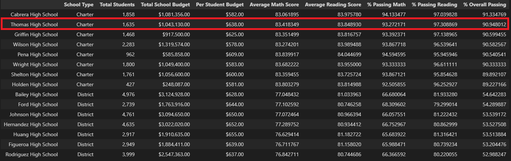
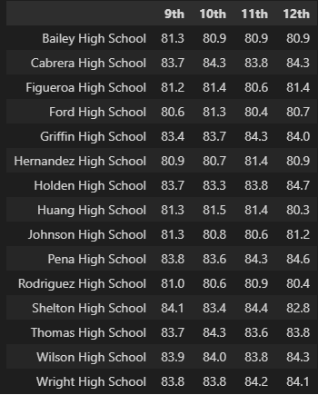
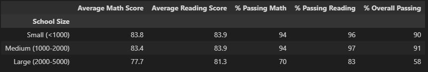

# PyCity Standardized Testing Analysis

## Overview

PyCity schools asked for an analysis of the latest standardized testing results.  The initial request from the schools was for all data to be summarized into the following resultsets:

* District Wide Results
* School Specific Results
* Math & Reading scores evaluated by
  * Grade
  * School Spending
  * School Size
  * School Type
  
The initial results and data provided created concerns that there was possible acedemic dishonesty in the Thomas High School (THS) 9th grade test scores. The school requested to see all the results without the THS 9th grade included in the averages and percentages. The following analysis is a discussion of how the results were impacted when the subset was removed.

## Results

Below we will present both sets of results to show the impact of removing the THS 9th graders.  

### District Summary

The comparision of District metrics shows a slight decrease in the districts Math scores (.1 point) and passing percentages (.1-.2%) when THS 9th graders are removed.  The reading score was unaffected.

*All Students*     

*Thomas High 9th Grade Students Removed*  

### School Summary

As seen below, when comparing looking at Thomas High School results specifically, we see a similar slight decrease in Math scores and percent passing in Math and Reading. However, **Reading scores improved** when the suspected dishonest grades were removed.    
The results below are sorted on overall percentage passing which reveals that the school rankings did not change when the suspect grades were removed.  

*All Students*     

*Thomas High 9th Grade Students Removed*  

### Grade Level Results

When the dataset is created for the school/grade-level view on Reading and Math scores, the 9th Grade THS value is now "nan" for the second set of data analyzed.  "nan" indicates that there is no values to be evaluated for that cross-section.

*Math - All Students (left); Thomas High 9th Grade Students Removed (right)*  
 

*Reading - All Students (left); Thomas High 9th Grade Students Removed (right)*  
 

### Scores by School Spending

To analyze the affects of per student spend on test results, we divided schools into 4 spending buckets.  Thomas High School spends $638 per student.  This puts them in the third spending bucket ($630-$644).  When combined with the other schools in this range, the results when rounded remain the same with or without the THS 9th grade students (if we presented more precision on the results, they would show slight differences in results).

*All Students*
 

*Thomas High 9th Grade Students Removed*

### Scores by School Size

*All Students*                  
 

*Thomas High 9th Grade Students Removed*

